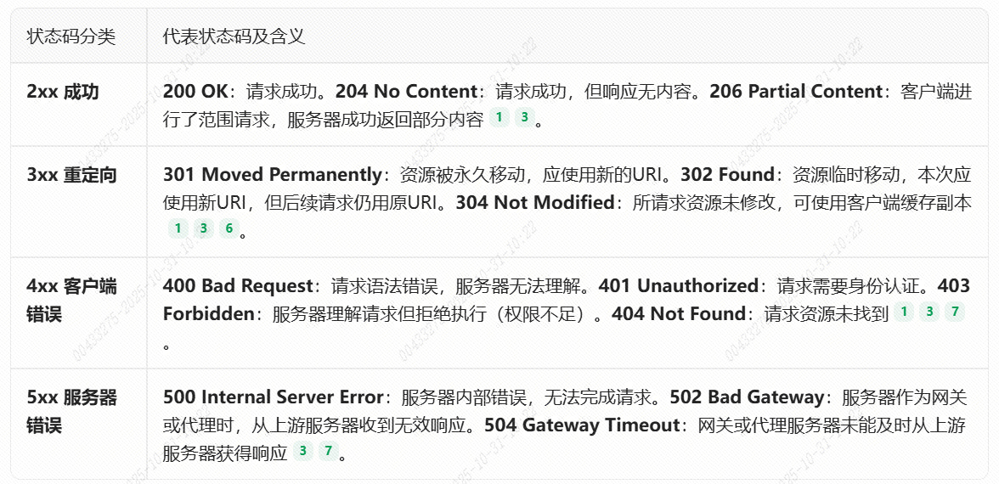

# HTTP 1.0 1.1 2.0 3.0 HTTPS

HTTP 是一种用于传输超文本的协议，它定义了客户端和 Web 服务器之间的通信。HTTP 的主要版本有 1.0、1.1、2.0、3.0 和 4.0。

## HTTP 1.0

- 发布于 1996 年，是首个广泛使用的 HTTP 版本
- 基于请求/响应模型，每次请求都需要建立新的 TCP 连接
- 无状态协议，服务器不保留请求之间的信息
- 主要方法包括 GET、POST 和 HEAD
- 不支持主机头(Host header)，限制了虚拟主机托管能力

## HTTP 1.1

- 发布于 1997 年，是对 HTTP 1.0 的重大改进
- 引入持久连接(Keep-Alive)，允许在一个 TCP 连接上发送多个请求
- 添加了 Host 头部，支持虚拟主机托管
- 引入断点续传功能，通过 Range 头部实现部分内容传输
- 新增 PUT、DELETE、OPTIONS、TRACE 等方法
- 支持缓存控制，包括 ETag、If-Modified-Since 等头部
- 引入管道化(pipelining)机制，允许多个请求同时发送

## HTTP 2.0

- 基于 Google 的 SPDY 协议，发布于 2015 年
- 采用二进制分帧层，不再是纯文本协议
- 实现多路复用，在单个连接上并行处理多个请求和响应
- 支持头部压缩(HPACK)，减少数据传输量
- 具有服务端推送(Server Push)功能，可主动向客户端发送资源
- 强制使用 TLS(Transport Layer Security)加密传输(某些实现)
- 请求优先级机制，优化资源加载顺序

## HTTP 3.0

- 基于 Google 的 QUIC 协议，发布于 2022 年
- 使用 UDP 而非 TCP 作为传输层协议
- 内置 TLS 1.3 加密，建立连接更快更安全
- 连接迁移(Connection Migration)功能，网络切换时保持连接
- 改进的拥塞控制机制
- 更好的前向纠错能力，降低丢包影响

## HTTPS

- HTTP over SSL/TLS 的简称，即安全的 HTTP
- 在 HTTP 和 TCP 之间加入 SSL/TLS 安全层
- 提供数据加密、身份认证和数据完整性保护
- 默认使用 443 端口而非 80 端口
- 需要数字证书来验证服务器身份
- 存在一定的性能开销，但现代技术已大幅降低这种影响

## HTTP 1.0、1.1、2.0、3.0 和 4.0 都是 HTTP 的主要版本，它们都提供了不同的功能和性能。以下是它们之间的主要区别：

### 1. HTTP 1.0 和 1.1 的主要区别是：

- HTTP 1.0 是最原始的 HTTP 版本，它基于请求/响应模型，每次请求都需要建立新的 TCP 连接。
- HTTP 1.1 引入了持久连接(Keep-Alive)，允许在一个 TCP 连接上发送多个请求。
- HTTP 1.1 添加了 Host 头部，支持虚拟主机托管。

### 2. HTTP 2.0 和 3.0 的主要区别是：

- HTTP 2.0 是基于 SPDY 协议的，它采用二进制分帧层，不再是纯文本协议。
- HTTP 2.0 实现了多路复用，在单个连接上并行处理多个请求和响应。
- HTTP 2.0 支持头部压缩(HPACK)，减少数据传输量。
- HTTP 2.0 添加了服务端推送(Server Push)功能，可主动向客户端发送资源。
- HTTP 2.0 强制使用 TLS 加密传输(某些实现)。
- HTTP 2.0 添加了请求优先级机制，优化资源加载顺序。

### 3. HTTP 3.0 的主要区别是：

- HTTP 3.0 是基于 QUIC 协议的，使用 UDP 而非 TCP 作为传输层协议。
- HTTP 3.0 内置 TLS 1.3 加密，建立连接更快更安全。
- HTTP 3.0 添加了连接迁移(Connection Migration)功能，网络切换时保持连接。
- HTTP 3.0 Improved congestion control.
- HTTP 3.0 添加了更好的前向纠错能力，降低丢包影响。

## HTTP 请求与响应 📡

### 请求报文结构：一个 HTTP 请求由三部分组成：

- 请求行：包含请求方法（如 GET、POST）、请求的 URI 和 HTTP 协议版本。
- 请求头（Headers）：包含关于客户端环境、请求正文信息等的键值对，如 Host, User-Agent, Content-Type 等。
- 请求体（Body）：可选，通常在 POST、PUT 等方法中携带发送给服务器的数据。

### 响应报文结构：服务器返回的响应也包含三部分：

- 状态行：包含 HTTP 版本、状态码和对应的状态消息（如 HTTP/1.1 200 OK）。
- 响应头（Headers）：包含关于服务器和返回资源的元信息，如 Server, Content-Type, 以及缓存相关头部等。
- 响应体（Body）：服务器返回的实际内容，如 HTML 文档、图片数据等。

### 常见状态码

## 缓存机制

良好的缓存策略能极大提升用户体验，减少服务器负载。

### 强缓存：浏览器优先检查是否命中强缓存。若命中，直接使用本地缓存，不发送请求到服务器。

通过响应头 Cache-Control（优先级高，如 max-age=3600 表示缓存 1 小时）和 Expires（HTTP/1.0 的绝对过期时间）控制。

### 协商缓存：当强缓存失效后，浏览器会携带缓存标识向服务器发起请求询问资源是否过期。

- 服务器根据请求头中的 If-None-Match（值为上次响应返回的 Etag）或 If-Modified-Since（值为上次响应返回的 Last-Modified）进行判断。
  若资源未变，服务器返回 304 Not Modified，浏览器继续使用缓存；若已变更，则返回 200 OK 和新资源。
- Etag（基于资源内容生成的唯一标识）比 Last-Modified（最后修改时间）更精确，能避免因时间粒度或文件仅修改时间但内容不变导致的无谓更新，
  因此优先级更高。

## 跨域问题与解决方案

跨域问题：浏览器同源策略（协议、域名、端口）限制了脚本访问不同源的资源，如：A.com 的脚本不能访问 B.com 的资源。

解决方案：

| Syntax | Description |
| 解决方案 | 机制 | 适用场景 | 优点 | 缺点 |
| ---------| ------ | ------ | ------ | ------ |
| CORS | 服务器设置 HTTP 响应头，告知浏览器允许跨域请求| 现代 Web 应用，需要多种 HTTP 方法（GET, POST, PUT 等）| 标准化的跨域解决方案，安全性高，支持所有 HTTP 方法 | 需要服务器端配置和支持 |
| 代理服务器 | 前端请求同源服务器，由该服务器代理转发请求至目标服务器 | 开发环境（如 webpack-dev-server），生产环境（Nginx） | 对浏览器透明，无需目标服务器做 CORS 配置，前端无感知 | 需要搭建和维护代理服务器 |
| JSONP | 通过\<script\>标签引入 JSON 数据，并在回调函数中处理数据 | 只支持 GET 请求的简单场景，兼容老旧浏览器，第三方 API 支持 | 兼容性极佳（支持老旧浏览器），实现简单 | 仅支持 GET 请求 |
| WebSocket | 使用 ws 或 wss 协议进行全双工通信，不受同源策略限制 | 需要实时双向通信的应用，如聊天室、在线游戏 | 真正的双向通信通道，不受同源策略约束 | 并非 HTTP 请求的替代品，需要服务器和支持 WebSocket |
