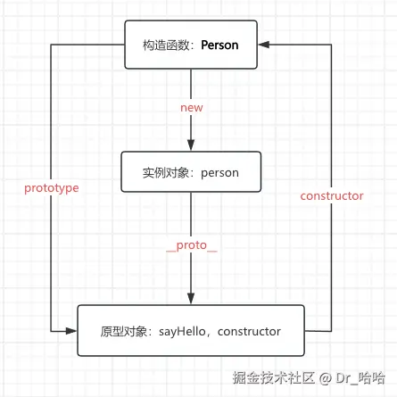

# 原型模式与原型链

## 原型模式

原型模式（Prototype Pattern）是一种创建型设计模式，它通过复制（克隆）现有对象来创建新对象，而不是通过实例化类。在 JavaScript 中，这种模式尤其重要，因为 JavaScript 本身就是基于原型的语言。

<blockquote>
<p>在原型模式下，当我们想要创建一个对象时，会先找到一个对象作为原型，然后通过<strong>克隆原型</strong>的方式来创建出一个与原型一样（共享一套数据/方法）的对象。<code>Object.create</code>方法就是原型模式的天然实现。</p>
</blockquote>

```javascript
// 创建一个原型对象
const userPrototype = {
  name: "默认用户",
  sayHello() {
    console.log(`你好，我是${this.name}`);
  },
  clone() {
    // 基于当前对象创建新对象
    return Object.create(this);
  },
};

// 使用原型创建新对象
const user1 = userPrototype.clone();
user1.name = "张三";
user1.sayHello(); // 输出：你好，我是张三

const user2 = userPrototype.clone();
user2.name = "李四";
user2.sayHello(); // 输出：你好，我是李四
```

## 原型链

在 JavaScript 中，每个构造函数都拥有一个 prototype 属性，它指向构造函数的原型对象，这个原型对象中有一个 constructor 属性指回构造函数；每个实例都有一个**proto**属性，当我们使用构造函数去创建实例时，实例的**proto**属性就会指向构造函数的原型对象。



[参考](https://juejin.cn/post/7500874757706891291)

## 手写 new

1. 创建一个空对象
2. 将空对象的原型指向构造函数的 prototype 属性
3. 将空对象赋值给 this，并执行构造函数
4. 返回 this

```javascript
function myNew(fn, ...args) {
  // const obj = {}
  // obj.__proto__ = fn.prototype
  const obj = Object.create(fn.prototype);
  const res = fn.apply(obj, args);
  return res instanceof Object ? res : obj;
}
```
